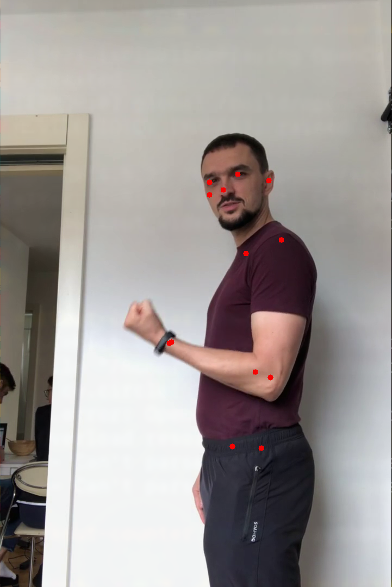
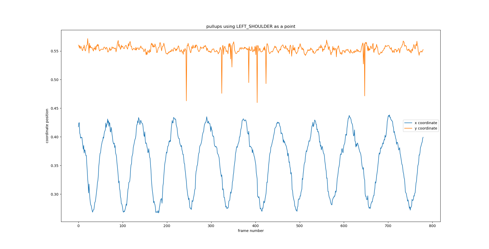
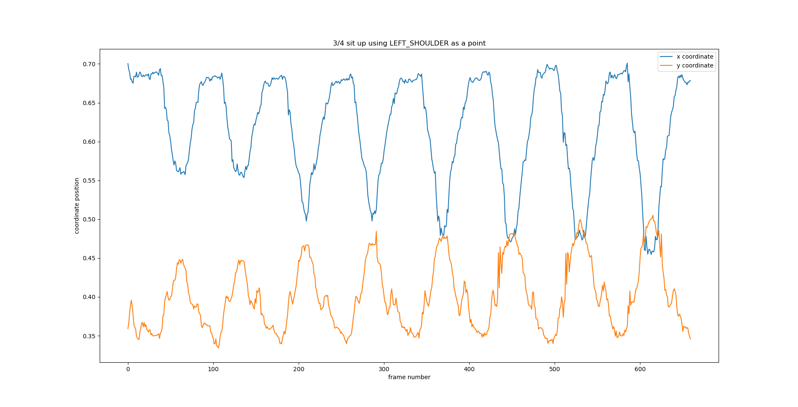
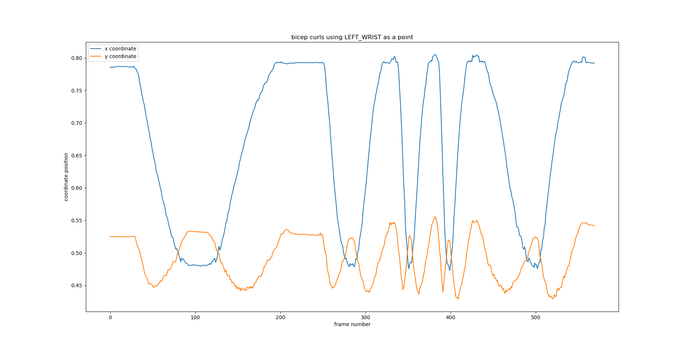
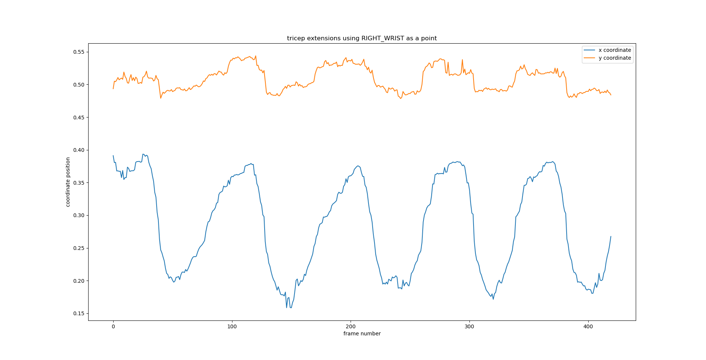
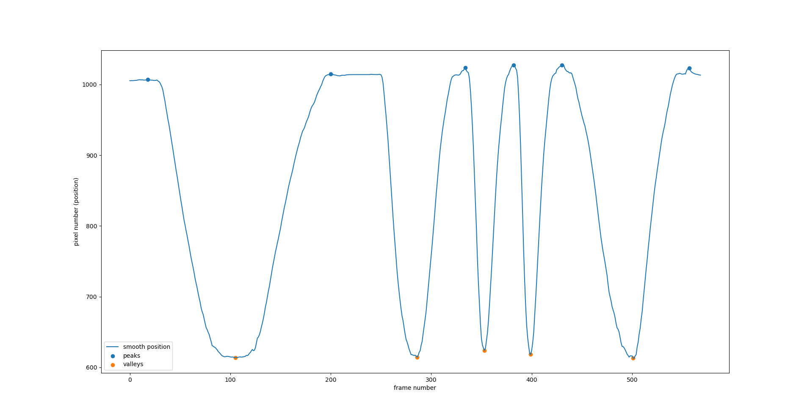

# workout-counter
Counting reps in the gym/home.

## idea
The goal of this project is to create an application that will be able to count exercise repetitions while recording a person during a workout.

## detecting human positions
The MoveNet neural network is used to detect body parts in workouts.

## drawing relevant point movement

## detecting peaks and valleys iteratively

## how to run
1. install python
2. install pip
3. install requirements `pip install -r requirements.txt`
4. (optional) find some pre-recorded videos
5. edit `app.py` (bottom of the file) to choose input (first argument of main) -- `0` means camera input, or give path to the video file you want to analyse
6. run the app with `python3 app.py`
